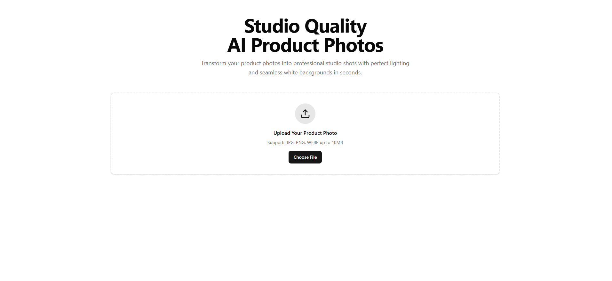

# Studio Quality AI - Product Photo Enhancer

Transform your product photos into professional studio shots with perfect lighting and seamless white backgrounds in seconds using the power of AI.



## 🎯 Overview

Studio Quality AI is a modern web application that leverages OpenAI's GPT-4o Vision and DALL-E 3 to automatically enhance product photos. Upload any product image, and the AI will analyze it, understand its characteristics, and generate a professional studio-quality version with:

- **Seamless white backgrounds** - Perfect for e-commerce listings
- **Professional lighting** - Even, bright softbox lighting that eliminates harsh shadows
- **High contrast and sharp focus** - Showcases textures and materials beautifully
- **Commercial aesthetic** - Ready-to-use product photos for online stores

## ✨ Features

- 📸 **AI-Powered Image Enhancement** - Uses GPT-4o Vision to analyze products and DALL-E 3 to generate enhanced images
- 🎨 **Professional Studio Quality** - Produces 1024x1024 HD images with commercial-grade aesthetics
- 🚀 **Fast Processing** - Get professional results in seconds
- 💻 **Modern UI** - Built with Next.js, React, and Tailwind CSS
- 📱 **Responsive Design** - Works seamlessly on desktop and mobile devices
- 🔄 **Real-time Preview** - See your original and enhanced images side-by-side
- ⬇️ **Easy Download** - Download enhanced images with one click

## 🛠️ Tech Stack

### Frontend
- **Next.js 16** - React framework with App Router
- **React 19** - UI library
- **TypeScript** - Type-safe development
- **Tailwind CSS 4** - Utility-first CSS framework
- **Radix UI** - Accessible component primitives
- **Lucide React** - Beautiful icon library

### Backend & AI
- **Vercel AI SDK** - Unified interface for AI models
- **OpenAI GPT-4o Mini** - Vision model for image analysis
- **DALL-E 3** - Image generation model
- **OpenAI SDK** - Direct integration with OpenAI APIs

### Development Tools
- **ESLint** - Code linting
- **PostCSS** - CSS processing
- **Class Variance Authority** - Component variant management

## 🚀 Getting Started

### Prerequisites

- Node.js 18+ and npm/yarn/pnpm
- OpenAI API key ([Get one here](https://platform.openai.com/api-keys))

### Installation

1. **Clone the repository**
   ```bash
   git clone <repository-url>
   cd studio-quality-ai
   ```

2. **Install dependencies**
   ```bash
   npm install
   # or
   yarn install
   # or
   pnpm install
   ```

3. **Set up environment variables**

   Create a `.env.local` file in the root directory:
   ```env
   OPENAI_API_KEY=your_openai_api_key_here
   ```

4. **Run the development server**
   ```bash
   npm run dev
   # or
   yarn dev
   # or
   pnpm dev
   ```

5. **Open your browser**
   
   Navigate to [http://localhost:3000](http://localhost:3000)

## 📖 How It Works

The application uses a two-step AI process to enhance your product photos:

### Step 1: Image Analysis (GPT-4o Mini Vision)
- The uploaded product image is analyzed by GPT-4o Mini Vision
- The AI identifies product characteristics:
  - Colors, materials, and textures
  - Shape, size, and key features
  - Current lighting and composition

### Step 2: Image Generation (DALL-E 3)
- Based on the analysis, GPT-4o creates a detailed prompt
- DALL-E 3 generates a new professional studio shot with:
  - Seamless white background (#FFFFFF)
  - Professional softbox lighting
  - High contrast and sharp focus
  - Commercial e-commerce aesthetic
  - Centered, well-composed product

## 🎨 Usage

1. **Upload Your Product Photo**
   - Click "Choose File" or drag and drop an image
   - Supported formats: JPG, PNG, WEBP (up to 10MB)

2. **Add Product Description (Optional)**
   - Enter a brief description of your product (e.g., "sneaker", "watch", "perfume bottle")
   - This helps the AI better understand your product

3. **Enhance Your Photo**
   - Click the "Enhance Photo" button
   - Wait for the AI to process your image (usually 10-30 seconds)

4. **Review and Download**
   - Compare the original and enhanced images side-by-side
   - Download your professional studio-quality photo

## 📁 Project Structure

```
studio-quality-ai/
├── app/
│   ├── api/
│   │   └── enhance-photo/
│   │       └── route.ts          # API endpoint for photo enhancement
│   ├── globals.css               # Global styles
│   ├── layout.tsx                # Root layout
│   └── page.tsx                  # Home page
├── components/
│   ├── photo-enhancer.tsx        # Main photo enhancement component
│   └── ui/
│       ├── button.tsx            # Button component
│       └── card.tsx              # Card component
├── lib/
│   └── utils.ts                  # Utility functions
└── public/                       # Static assets
```

## 🔧 Configuration

### API Endpoint

The photo enhancement API is located at `/api/enhance-photo` and accepts:
- `image`: Base64-encoded image data URL
- `productDescription`: Optional product description string

### Environment Variables

| Variable | Description | Required |
|----------|-------------|----------|
| `OPENAI_API_KEY` | Your OpenAI API key | Yes |

## 🚢 Deployment

### Deploy to Vercel (Recommended)

1. Push your code to GitHub
2. Import your repository in [Vercel](https://vercel.com)
3. Add your `OPENAI_API_KEY` environment variable
4. Deploy!

The application will automatically build and deploy.

### Other Platforms

The application can be deployed to any platform that supports Next.js:
- Netlify
- AWS Amplify
- Railway
- Render

Make sure to set the `OPENAI_API_KEY` environment variable in your deployment platform.

## 📝 Scripts

- `npm run dev` - Start development server
- `npm run build` - Build for production
- `npm run start` - Start production server
- `npm run lint` - Run ESLint

## 🎯 Features Roadmap

- [ ] Batch processing for multiple images
- [ ] Custom background colors
- [ ] Different lighting styles
- [ ] Image format options (PNG, JPG, WEBP)
- [ ] Image size options
- [ ] History of enhanced images
- [ ] User accounts and saved images

## 🤝 Contributing

Contributions are welcome! Please feel free to submit a Pull Request.

## 📄 License

This project is private and proprietary.
